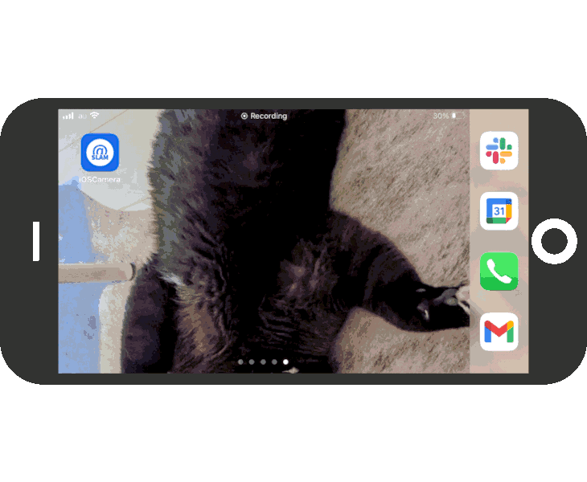

  

  

SLAM@HOME
==============================
An implementation of a real-time SLAM system over a local Wi-Fi network. This project was initially started for my self-learning purpose so the implementation is not production ready and may include performance issues and/or edge cases but I still believe this can be a code example for something like a DIY 3D scanner project or a DIY 3D survelliance system. Hope you will like it.

  

Implementation Notes
==============================
 1. **React/Frontend**

	All components (except the markdown parser and social buttons) are built using vanilla React. 

 2. **Express/Signaling**

	This is the possibly simplest implementation of a signaling server for WebRTC. It only provides the minimal set of functionalities required to exchange Session Description Protocols for establishing peer connections.

 3. **iOS/Camera**

	A monocular depth estimater/sampler implementation for iOS. The estimated and/or sampled depth data is streamed via a peer connection to the frontend. The WebRTC SDK is GoogleWebRTC and the depth estimation is based on a machine learning model for now [4/17/2022] but this **will be replaced with LiDAR camera** due to the incompatible design of the SDK with AVFoundation causing performance issues. **App Transport Security restrictions are disabled** since the system is supposed to be deployed only on your local network.
   
 4. **MLModels**

	A collection of machine learning models which is used for iOS/Camera. This directory may be deprecated someday due to the reasons mentioned above.
 
 5. **Wgpu/Core**

	The SLAM core engine for reconstructing 3D models from the video stream. The engine will be implemented in Rust.

TODO
==============================
 - LiDAR over DataChannel
 - Recording
 - WebGPU engine
 - Android
 - Manage CMSampleBuffer
 Use current AVCaptureSession on WebRTC on iOS devices
 https://groups.google.com/g/discuss-webrtc/c/8TgRy9YWvVc
 https://stackoverflow.com/questions/28265880/use-current-avcapturesession-on-webrtc-on-ios-devices
